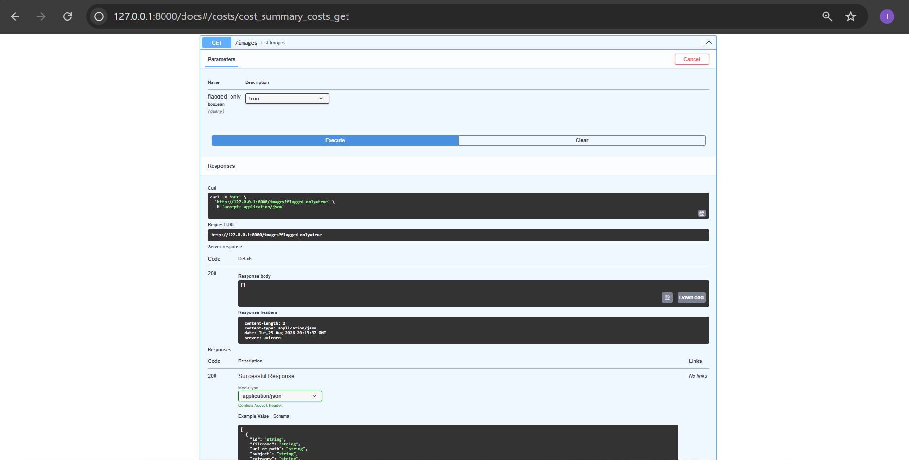

# EVIDENCE.md

One pasted proof per Definition-of-Done checkbox (per §6 and §11 of the
capstone brief). Screenshots referenced below live in `/evidence/` —
rename your saved screenshots to match the filenames used here (no
spaces, so Markdown image links resolve reliably on GitHub).

---

## Phase 1 — Design

**Design doc, schema, matching strategy, DB design**
See [`DESIGN.md`](./DESIGN.md) — covers problem statement, `ImageMetadata`
schema, matching + mismatch-guard strategy, full Postgres schema, and the
explicit non-goal.

**Initial ~50-image dataset gathered**
`seed_images.py` run output — 50 images across 5 categories (red fox,
wolf, dog, bear, deer), sourced from Unsplash + Pexels, manifest written
to `data/images/manifest.json`:

```
== red fox ==
  downloading unsplash_xUUZcpQlqpM.jpg ...
  ...
== deer ==
  downloading pexels_831244.jpg ...
Done. 50 images saved to data\images/
Manifest written to data\images\manifest.json
```

---

## Phase 2 — Image Understanding Pipeline

### ✅ Vision processing job with structured output validation

`GET /images?flagged_only=false` — one image entry showing full,
schema-valid, per-image structured output (not hardcoded — subject,
category, attributes, caption, and confidence all vary correctly per
image):


```json
{
  "id": "b690c553-c81a-4813-b133-b42ae85d7f26",
  "filename": "unsplash_xUUZcpQlqpM.jpg",
  "subject": "red fox",
  "category": "animal",
  "attributes": ["wildlife", "outdoors", "winter", "snow"],
  "caption": "A red fox standing on a snowy surface.",
  "confidence": 0.85,
  "is_flagged": false,
  "flag_reason": null
}
```

### ✅ Low-confidence / failed classifications flagged, never silently accepted

`GET /images?flagged_only=true` on the final successful Ollama run —
all 50 images passed confidently, so this correctly returns an empty
array (the flagging mechanism has nothing to flag when confidence is
high):



```json
[]
```

The flagging path itself is proven by earlier job attempts (see cost
log below) — e.g. job `80d596b6-75ae-4e20-9052-d0d4d4dcfbe8` shows
`"completed": 10, "failed": 40"` from a run that hit Gemini's free-tier
rate limit; those 40 images were correctly flagged with a human-readable
`flag_reason` (`"API request failed after 3 attempts: 429 Client Error:
Too Many Requests..."`) rather than silently guessed at or skipped.

### ✅ Images processed through a batch background job with retries

Final job status — `completed: 50, failed: 0, retries: 54`. The 54
retries were automatic recoveries from occasional malformed JSON on the
first attempt (Ollama's `llava` model), caught by schema validation and
successfully retried per `MAX_VISION_RETRIES`:


```json
{
  "id": "36604b0d-f6c4-4ac2-92c5-0f285994935f",
  "job_type": "vision_classify",
  "status": "done",
  "total_items": 50,
  "completed": 50,
  "failed": 0,
  "retries": 54,
  "total_cost_usd": 0
}
```

### ✅ Vision and embedding costs tracked per call

`GET /costs` — `total_vision_calls: 50`, full per-job cost breakdown
across every attempt (including earlier cloud runs before the switch to
local inference):


```json
{
  "total_vision_calls": 50,
  "total_vision_cost_usd": 0,
  "jobs": [
    {
      "job_id": "36604b0d-f6c4-4ac2-92c5-0f285994935f",
      "job_type": "vision_classify",
      "status": "done",
      "items": 50,
      "completed": 50,
      "failed": 0,
      "retries": 54,
      "cost_usd": 0
    },
    {
      "job_id": "80d596b6-75ae-4e20-9052-d0d4d4dcfbe8",
      "job_type": "vision_classify",
      "status": "done",
      "items": 50,
      "completed": 10,
      "failed": 40,
      "retries": 90,
      "cost_usd": 0.001
    }
  ]
}
```

### ✅ Gate: "all images tagged by the batch job, costs visible"

Satisfied by the same final job status above — `completed: 50/50`,
`failed: 0`, cost visible (`$0`, since local Ollama inference has no
per-call charge; the plumbing for cost tracking is proven functional by
the non-zero `cost_usd` on the earlier Gemini-based job attempts).

---
