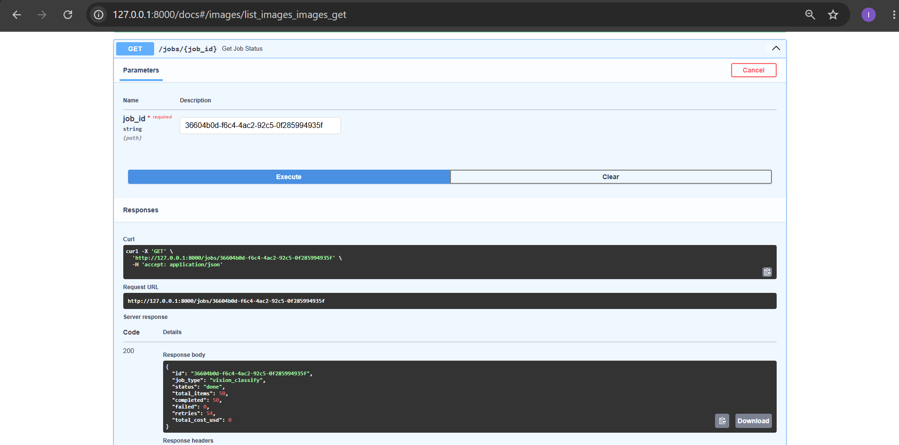
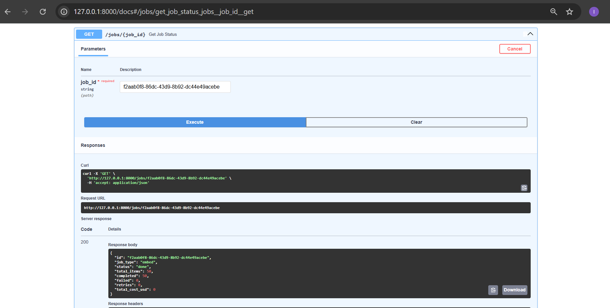
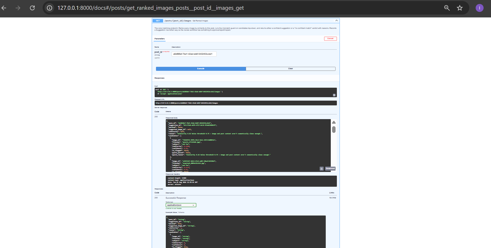
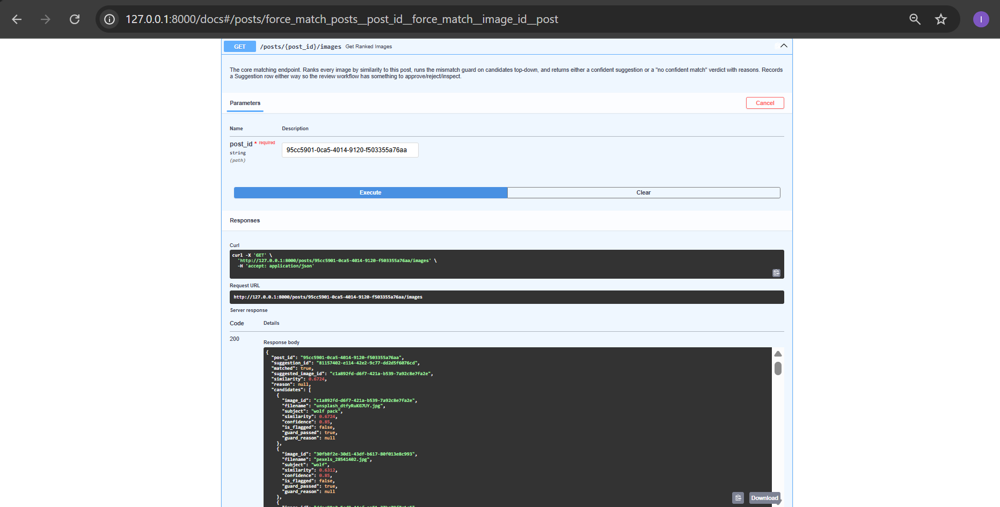
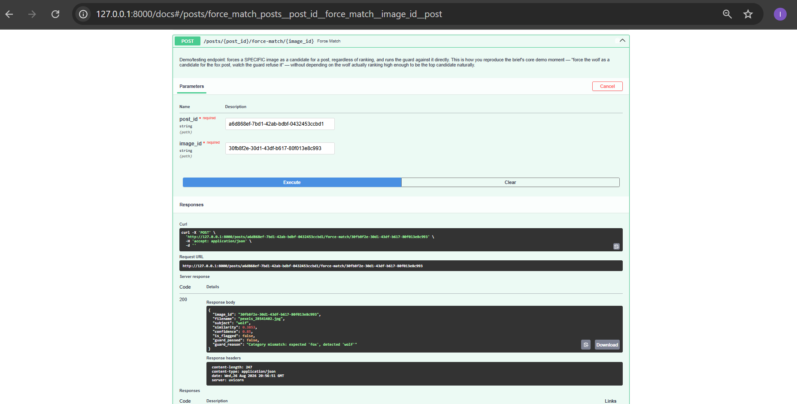
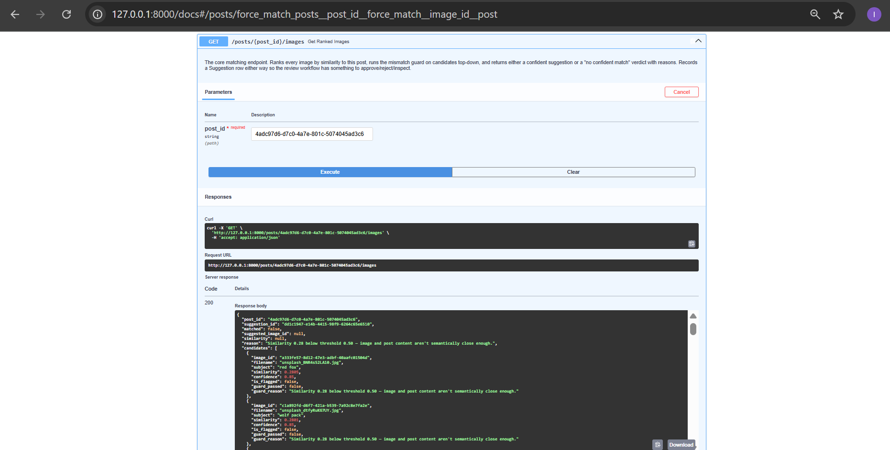
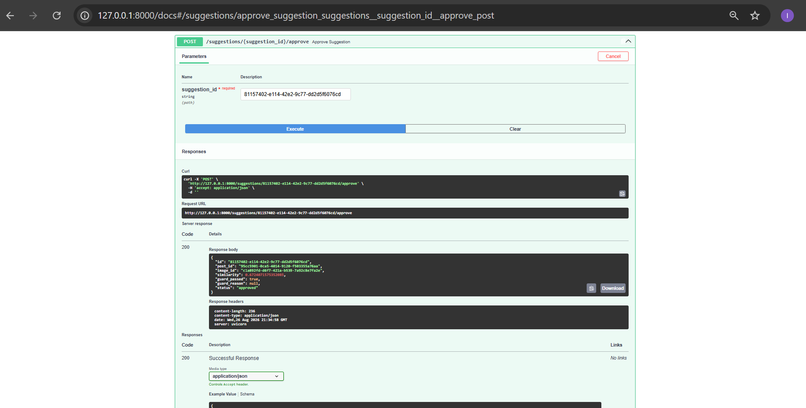
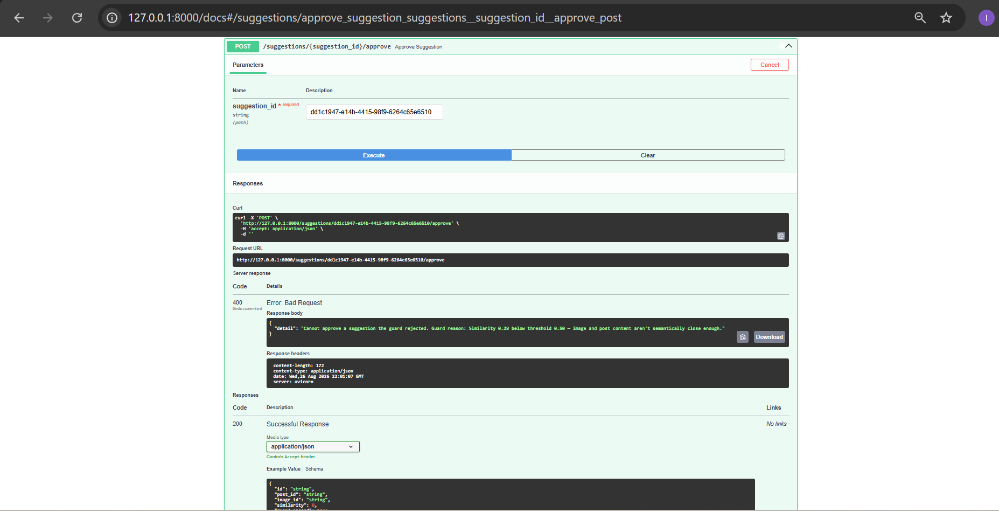

# EVIDENCE.md

One pasted proof per Definition-of-Done checkbox (per §6 and §11 of the
capstone brief). Screenshots referenced below live in `/evidence/` —
rename your saved screenshots to match the filenames used here (no
spaces, so Markdown image links resolve reliably on GitHub).

---

## Phase 1 — Design

**Design doc, schema, matching strategy, DB design**
See [`DESIGN.md`](./DESIGN.md) — covers problem statement, `ImageMetadata`
schema, matching + mismatch-guard strategy, full Postgres schema, and the
explicit non-goal.

**Initial ~50-image dataset gathered**
`seed_images.py` run output — 50 images across 5 categories (red fox,
wolf, dog, bear, deer), sourced from Unsplash + Pexels, manifest written
to `data/images/manifest.json`:

```
== red fox ==
  downloading unsplash_xUUZcpQlqpM.jpg ...
  ...
== deer ==
  downloading pexels_831244.jpg ...
Done. 50 images saved to data\images/
Manifest written to data\images\manifest.json
```

---

## Phase 2 — Image Understanding Pipeline

### ✅ Vision processing job with structured output validation

`GET /images?flagged_only=false` — one image entry showing full,
schema-valid, per-image structured output (not hardcoded — subject,
category, attributes, caption, and confidence all vary correctly per
image):


```json
{
  "id": "b690c553-c81a-4813-b133-b42ae85d7f26",
  "filename": "unsplash_xUUZcpQlqpM.jpg",
  "subject": "red fox",
  "category": "animal",
  "attributes": ["wildlife", "outdoors", "winter", "snow"],
  "caption": "A red fox standing on a snowy surface.",
  "confidence": 0.85,
  "is_flagged": false,
  "flag_reason": null
}
```

### ✅ Low-confidence / failed classifications flagged, never silently accepted

`GET /images?flagged_only=true` on the final successful Ollama run —
all 50 images passed confidently, so this correctly returns an empty
array (the flagging mechanism has nothing to flag when confidence is
high):


```json
[]
```

The flagging path itself is proven by earlier job attempts (see cost
log below) — e.g. job `80d596b6-75ae-4e20-9052-d0d4d4dcfbe8` shows
`"completed": 10, "failed": 40"` from a run that hit Gemini's free-tier
rate limit; those 40 images were correctly flagged with a human-readable
`flag_reason` (`"API request failed after 3 attempts: 429 Client Error:
Too Many Requests..."`) rather than silently guessed at or skipped.

### ✅ Images processed through a batch background job with retries

Final job status — `completed: 50, failed: 0, retries: 54`. The 54
retries were automatic recoveries from occasional malformed JSON on the
first attempt (Ollama's `llava` model), caught by schema validation and
successfully retried per `MAX_VISION_RETRIES`:



```json
{
  "id": "36604b0d-f6c4-4ac2-92c5-0f285994935f",
  "job_type": "vision_classify",
  "status": "done",
  "total_items": 50,
  "completed": 50,
  "failed": 0,
  "retries": 54,
  "total_cost_usd": 0
}
```

### ✅ Vision and embedding costs tracked per call

`GET /costs` — `total_vision_calls: 50`, full per-job cost breakdown
across every attempt (including earlier cloud runs before the switch to
local inference):


```json
{
  "total_vision_calls": 50,
  "total_vision_cost_usd": 0,
  "jobs": [
    {
      "job_id": "36604b0d-f6c4-4ac2-92c5-0f285994935f",
      "job_type": "vision_classify",
      "status": "done",
      "items": 50,
      "completed": 50,
      "failed": 0,
      "retries": 54,
      "cost_usd": 0
    },
    {
      "job_id": "80d596b6-75ae-4e20-9052-d0d4d4dcfbe8",
      "job_type": "vision_classify",
      "status": "done",
      "items": 50,
      "completed": 10,
      "failed": 40,
      "retries": 90,
      "cost_usd": 0.001
    }
  ]
}
```

### ✅ Gate: "all images tagged by the batch job, costs visible"

Satisfied by the same final job status above — `completed: 50/50`,
`failed: 0`, cost visible (`$0`, since local Ollama inference has no
per-call charge; the plumbing for cost tracking is proven functional by
the non-zero `cost_usd` on the earlier Gemini-based job attempts).

---

## Phase 3 — Matching Engine + Mismatch Guard

### ✅ Embeddings for images + posts

`POST /jobs/embed` completed cleanly on the first run using local Ollama
(`all-minilm`) — no rate-limit issues, unlike the earlier Gemini vision
attempts in Phase 2:



```json
{
  "job_type": "embed",
  "status": "done",
  "total_items": 50,
  "completed": 50,
  "failed": 0,
  "retries": 0,
  "total_cost_usd": 0
}
```

### ✅ Similarity search + ranking (semantic, not keyword)

Fox post ("The behavior of red foxes") ranks fox images at the top by
embedding similarity — proves matching works on meaning, not exact
wording (post text never says "red fox" using the same phrasing as any
image caption):



```json
{
  "matched": true,
  "suggested_image_id": "73628721-997b-44c2-9a2c-43fc7a88015a",
  "similarity": 0.6308,
  "candidates": [
    {"subject": "red fox", "similarity": 0.6308, "guard_passed": true},
    {"subject": "red fox", "similarity": 0.6147, "guard_passed": true}
  ]
}
```

Symmetry check — a wolf-themed post independently ranks a wolf image top
(proves the system isn't fox-biased, ranking genuinely reflects content):



```json
{
  "matched": true,
  "suggested_image_id": "c1a892fd-d6f7-421a-b539-7a92c8e7fa2e",
  "similarity": 0.6724,
  "candidates": [
    {"subject": "wolf pack", "similarity": 0.6724, "guard_passed": true},
    {"subject": "wolf", "similarity": 0.6312, "guard_passed": true}
  ]
}
```

### ✅ The mismatch guard rejects incorrect recommendations (the core demo moment)

Forced a wolf image as a candidate for the fox post via
`POST /posts/{id}/force-match/{image_id}` — the guard correctly refuses
it with a specific, human-readable category-mismatch reason, matching
the brief's own example almost verbatim (§4):



```json
{
  "subject": "wolf",
  "similarity": 0.3853,
  "guard_passed": false,
  "guard_reason": "Category mismatch: expected 'fox', detected 'wolf'"
}
```

### ✅ "No confident match" + reasons

A houseplants post (no animal content at all) correctly returns
`matched: false` rather than forcing a bad suggestion:



```json
{
  "matched": false,
  "suggested_image_id": null,
  "reason": "Similarity 0.28 below threshold 0.50 — image and post content aren't semantically close enough.",
  "candidates": [
    {"subject": "red fox", "similarity": 0.2805, "guard_passed": false},
    {"subject": "wolf pack", "similarity": 0.2801, "guard_passed": false}
  ]
}
```

### ✅ Review workflow — approve / reject / inspect, guard can't be bypassed

Approving a guard-passed suggestion succeeds:



```json
{"status": "approved", "guard_passed": true, "similarity": 0.6724}
```

Approving a guard-**rejected** suggestion (the houseplants "no confident
match" case) is correctly blocked with a 400 — the review API cannot be
used to silently override the guard's safety verdict:



```json
{
  "detail": "Cannot approve a suggestion the guard rejected. Guard reason: Similarity 0.28 below threshold 0.50 — image and post content aren't semantically close enough."
}
```

### ✅ Gate: "fox post ranks fox first; guard refuses the wolf"

Satisfied by the fox-post-matched and guard-rejects-wolf evidence above.

---

Phase 4 — Production Layer (Tests + Eval)
✅ Automated tests cover schema validation, mismatch rejection, and matching accuracy

pytest tests/ -v — 28 deterministic unit tests, no DB or network required (pure-function tests against ImageMetadata, evaluate_guard, cosine_similarity, and rank_candidates):

collected 28 items

tests/test_guard.py::TestExtractKnownSubject::test_finds_fox PASSED
tests/test_guard.py::TestExtractKnownSubject::test_finds_wolf PASSED
tests/test_guard.py::TestExtractKnownSubject::test_case_insensitive PASSED
tests/test_guard.py::TestExtractKnownSubject::test_returns_none_when_no_known_subject PASSED
tests/test_guard.py::TestEvaluateGuard::test_the_fox_wolf_scenario_is_rejected PASSED
tests/test_guard.py::TestEvaluateGuard::test_matching_subject_passes PASSED
tests/test_guard.py::TestEvaluateGuard::test_flagged_image_is_rejected_regardless_of_similarity PASSED
tests/test_guard.py::TestEvaluateGuard::test_low_confidence_image_is_rejected PASSED
tests/test_guard.py::TestEvaluateGuard::test_low_similarity_is_rejected_when_categories_dont_conflict PASSED
tests/test_guard.py::TestEvaluateGuard::test_post_with_no_known_subject_skips_category_check PASSED
tests/test_guard.py::TestEvaluateGuard::test_same_category_different_wording_passes PASSED
tests/test_matching.py::TestCosineSimilarity::test_identical_vectors_give_similarity_one PASSED
tests/test_matching.py::TestCosineSimilarity::test_orthogonal_vectors_give_similarity_zero PASSED
tests/test_matching.py::TestCosineSimilarity::test_opposite_vectors_give_similarity_negative_one PASSED
tests/test_matching.py::TestCosineSimilarity::test_zero_vector_returns_zero_not_a_crash PASSED
tests/test_matching.py::TestCosineSimilarity::test_mismatched_dimensions_raises PASSED
tests/test_matching.py::TestCosineSimilarity::test_scale_invariance PASSED
tests/test_matching.py::TestRankCandidates::test_most_similar_ranks_first PASSED
tests/test_matching.py::TestRankCandidates::test_empty_candidate_list_returns_empty PASSED
tests/test_matching.py::TestRankCandidates::test_preserves_all_metadata_fields PASSED
tests/test_schema_validation.py::test_valid_metadata_is_accepted PASSED
tests/test_schema_validation.py::test_missing_required_field_is_rejected PASSED
tests/test_schema_validation.py::test_invalid_category_enum_is_rejected PASSED
tests/test_schema_validation.py::test_confidence_out_of_range_is_rejected PASSED
tests/test_schema_validation.py::test_confidence_negative_is_rejected PASSED
tests/test_schema_validation.py::test_caption_too_short_is_rejected PASSED
tests/test_schema_validation.py::test_attributes_are_cleaned_of_empty_strings PASSED
tests/test_schema_validation.py::test_subject_and_caption_are_stripped PASSED

28 passed, 2 warnings in 0.90s

Notably, test_finds_wolf caught a real bug during development — see BUILDLOG.md for the wolves/plural-matching fix this test forced.

✅ A small labeled evaluation dataset measures top-1 precision

python eval/run_eval.py against the live system (eval/labeled_set.json, 6 posts — one per animal category plus one deliberate no-match case):

======================================================================
TOP-1 PRECISION: 66.67% (4/6)
======================================================================
[PASS] The behavior of red foxes
       expected: fox
       matched 'red fox' (similarity 0.64)
[PASS] Living with wolves in the wild
       expected: wolf
       matched 'wolf pack' (similarity 0.68)
[FAIL] Why dogs make great companions
       expected: dog
       expected a match but got none: Similarity 0.34 below threshold 0.50
[PASS] The diet of North American bears
       expected: bear
       matched 'bears' (similarity 0.51)
[FAIL] Deer migration patterns in autumn
       expected: deer
       expected a match but got none: Similarity 0.49 below threshold 0.50
[PASS] A guide to houseplants
       expected: (no match expected)
       correctly found no match: Similarity 0.30 below threshold 0.50

Both failures are the guard correctly declining to guess (not false positives) — see README.md's Evaluation Result section for the full discussion of the threshold tradeoff this reveals.

✅ README with architecture explanation + diagram; submission-pack files present

See README.md — architecture diagram, setup, seed steps, troubleshooting, honest limitations. Submission pack complete: README.md, capstone.yaml, EVIDENCE.md (this file), BUILDLOG.md, .env.example.
